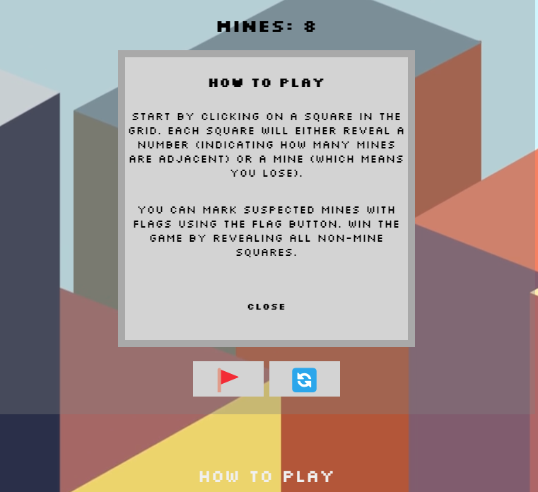
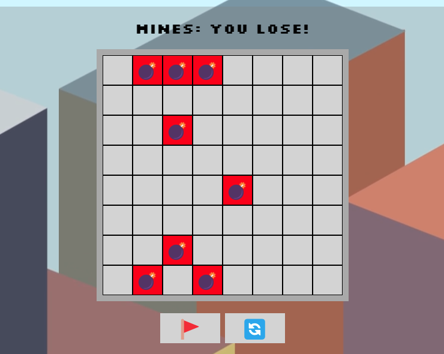
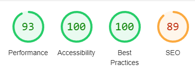

# MineSweeper
This game is a browser based version of the Minesweeper videogame originally created by Microsoft in the 1990's. The idea of the game is to clear all of the cells which don't contain a mine; if you click on a square with a mine it's game over! Once you have completed a level you can click new game to start a new one.

The live link can be found at - [MineSweeper](https://darrenrob25.github.io/MineSweeperProject/)

***

## Project Goals and User Experience

### Project Goals
* The goal of this project is to make a fun recreation of the minesweeper game within the browser.

* It has beeen designed to be easy to play and enjoyable.

### User Stories
#### First Time User
|Story No.|Story|
| ------------- | ------------- |
|1|As a first time user ,   I want to be able to know how to start the game   so that I can enjoy the game.    I know I am done, when there is a clear button to start the game.|
|2|As a first time user,   I want to be able to know how to play the game   so that I know I am playing the game correctly.   I know this has been achieved when the user can view the game instructions. |
|3|As a first time user,   I want to be able to know when I have hit a mine  so that I understand when the game is over   I know I am done there is a notification that the game is over. |

#### All Users
|Story No.|Story|
| ------------- | ------------- |
|1|As a user,   I want to be able to play the game   so that I can enjoy the game.    I know I am done, when the game is in a fully playable state. |
|2|As a user,   I want to be able to restart the game   so that I can play again if I lose/win.    I know this has been achieved there is the ability to restart the game. |

***

## Design
### Wireframes
Below are the designs that I will use as a reference point to help build the site. I have built these designs while keeping in mind the needs of my user stories.

#### Game Page Design

#### Color Choices
The Colour palette was generated on [coolors](https://coolors.co/)

#### Font Choice
Google fonts were used to import fonts for this project:
* Press Start 2P

* Silkscreen

***

## Features
### Gameboard
The gameboard, where the game is played, clicking on inndividual cells will check that cell for a mine.

### Flag Button
When toggled on the flag button will place a flag on the gameboard, instead of checking if there's a mine. This can be used to mark suspected mines.

### Restart/Refresh Button
When clicked, this button will refresh the game - this can be utilised when game over or if you want to start from scratch.

### How to Play Button
When clicked, the button will replace the gameboard with instructions on how to play the game, which will help new users understand how to play.

### Mine Count
This displays the number of mines present on the board, it updated when you win or lose to tell you whether you have lost the game or won.

## Future Implementations
* A feature that I would like to add in the future would be the ability to increase/decrease difficulty by adding or removing from the number of mines. This will increase replayability.
* A feature that I would also like to add in the future would be audio, perhaps an 8bit ping when a tile is clicked and the ability to toggle sound on and off.
* A final feature I would like to add in the future would be a highscore table, this would increase the competitive nature of the game.

***

## Testing
### Validator Testing
#### HTML
No Errors were presented when passing the project through the official W3C validator.

https://validator.w3.org/nu/?doc=https%3A%2F%2Fdarrenrob25.github.io%2FMineSweeperProject%2F

#### CSS
No errors were found when passing the project through the official Jigsaw validator.

https://jigsaw.w3.org/css-validator/validator?uri=https%3A%2F%2Fdarrenrob25.github.io%2FMineSweeperProject%2F&profile=css3svg&usermedium=all&warning=1&vextwarning=&lang=en

#### JS
There were no errors when passing the js through the official JSHint Validator.
The below metrics were returned:
* There are 12 functions in this file.
* The function with the largest signature takes 2 arguments, the median is 0.
* The largest function has 29 statements in it, the median is 6.5
* The most complex function has a cyclomatic complexity value of 8 with the median being 3.

### User Stories Testing
#### First Time User
|Story No.|Result|Story/ Evidence|
| ------------- | ------------- | ------------- |
|1|Test Pass|As a first time user ,   I want to be able to know how to start the game.   so that I can enjoy the game    I know I am done when their are clear instructions shown to the user.   Evidence: The gamepage has a clear how to play button, signposting people who do not know how to play.  |
|2|Test Pass |As a first time user,   I want to be able to know how to play the game   so that I know I am playing the game correctly.   I know this has been achieved when the user can view the game instructions.   Evidence: In the how to play section, there is a clear outline on how to play the game.  |
|3|Test Pass |As a first time user,   I want to be able to know when I have hit a mine  so that I understand when the game is over   I know I am done there is a notification that the game is over.   Evidence: A clear message is displayed when the game is over, whether you've won or lost.  |

#### All Users
|Story No.|Result|Story/ Evidence|
| ------------- | ------------- | ------------- |
|1|Test Pass |As a user,   I want to be able to play the game   so that I can enjoy the game.    I know I am done, when the game is in a fully playable state.  Evidence: The game is in a playable state.  |
|2|Test Pass |As a user,   I want to be able to restart the game   so that I can play again if I lose/win.   Evidence: The reset buttion allows you to restart the game  |

### Accessibility Testing

| Game |
| ------- |
|  |

### Manual Testing
* I have tested that the project works in different web browsers.
* I have tested that the project is responsive and works with different device sizes and it looks good and functions correctly.
* I have tested all links and they work correctly.
* I have tested that the game works correctly and can be played.
* I have tested that the flag function works and can be selected and deselected.
* I have tested the restart game function, which works correctly.
* I have tested opening and closing the instructions button.
* I have tested the game by playing and both winning and losing.

### Fixed Bugs

#### 
#### Instructions Bug
On the instructions on phone the close button was appearing on the right outside of the gameboard.
To fix this I created a media query to decrease font size on smaller screen devices.

#### CheckMines Function Bug
The checkMines function was not working correctly, resulting in the gameboard disappearing.
To fix this, I fixed the logic in the function, I had some errors in regards to mistyping variable names and logical issues.

#### Background Video Bug
The background video was not pulling through properly to GitHub Pages.
Upon further inspection its because the link in code started with / github pages doesnt work if you start the link with a / removing it pulled the background through correctly.

***
### Cloning & Forking
#### Fork
1. On GitHub.com, navigate to the [Minesweeper](https://github.com/darrenrob25/MineSweeperProject) repository.
2. In the top-right corner of the page, click Fork.
3. By default, forks are named the same as their parent repositories. You can change the name of the fork to distinguish it further.
4. Add a description to your fork.
5. Click Create fork.

#### Clone
1. Above the list of files click the button that says 'Code'.
2. Copy the URL for the repository.
3. Open Terminal. Change the directory to the location where you want the cloned directory.
4. Type git clone, and then paste the URL
5. Press Enter.

### Local Deployment
1. Sign up to [Gitpod](https://gitpod.io/)
2. Download the Gitpod browser extension.
3. On GitHub.com, navigate to the [Minesweeper](https://github.com/darrenrob25/MineSweeperProject) repository.
4. Above the list of files click the button that says 'Gitpod'.

### Remote Deployment
 The site was deployed to Github pages. If you have forked/cloned the repository the steps to deploy are:
 1. On GitHub.com, navigate to your repository.
 2. Navigate to the settings tab.
 3. Click on the tab called 'pages' on the left hand side.
 4. From the source drop down list under the heading Build and deployment, select main.
 5. The page will then provide the link to the website.

 The live link can be found here - [Minesweeper](https://darrenrob25.github.io/MineSweeperProject/)

*** 

