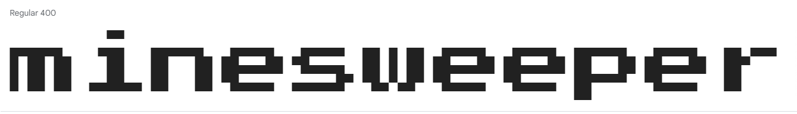
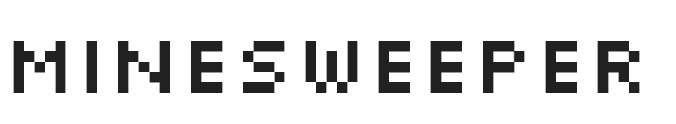
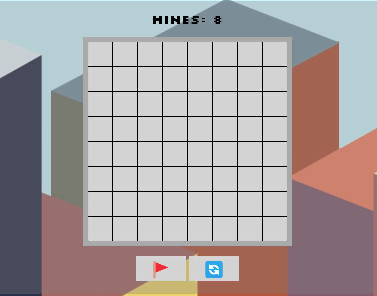

# MineSweeper
This game is a browser based version of the Minesweeper videogame originally created by Microsoft in the 1990's. The idea of the game is to clear all of the cells which don't contain a mine; if you click on a square with a mine it's game over! Once you have completed a level you can click new game to start a new one.

The live link can be found at - [MineSweeper](https://darrenrob25.github.io/MineSweeperProject/)

***

## Project Goals and User Experience

### Project Goals
* The goal of this project is to make a fun recreation of the minesweeper game within the browser.

* It has beeen designed to be easy to play and enjoyable.

### User Stories
#### First Time User
|Story No.|Story|
| ------------- | ------------- |
|1|As a first time user ,   I want to be able to know how to start the game   so that I can enjoy the game.    I know I am done, when there is a clear button to start the game.|
|2|As a first time user,   I want to be able to know how to play the game   so that I know I am playing the game correctly.   I know this has been achieved when the user can view the game instructions. |
|3|As a first time user,   I want to be able to know when I have hit a mine  so that I understand when the game is over   I know I am done there is a notification that the game is over. |

#### All Users
|Story No.|Story|
| ------------- | ------------- |
|1|As a user,   I want to be able to play the game   so that I can enjoy the game.    I know I am done, when the game is in a fully playable state. |
|2|As a user,   I want to be able to restart the game   so that I can play again if I lose/win.    I know this has been achieved there is the ability to restart the game. |

***

## Design
### Wireframes
Below are the designs that I will use as a reference point to help build the site. I have built these designs while keeping in mind the needs of my user stories.

#### Game Page Design

#### Color Choices
The Colour palette was generated on [coolors](https://coolors.co/)

#### Font Choice
Google fonts were used to import fonts for this project:
* Press Start 2P

* Silkscreen

***

## Features
### Gameboard
The gameboard, where the game is played, clicking on inndividual cells will check that cell for a mine.

### Flag Button
When toggled on the flag button will place a flag on the gameboard, instead of checking if there's a mine. This can be used to mark suspected mines.

### Restart/Refresh Button
When clicked, this button will refresh the game - this can be utilised when game over or if you want to start from scratch.

### How to Play Button
When clicked, the button will replace the gameboard with instructions on how to play the game, which will help new users understand how to play.

### Mine Count
This displays the number of mines present on the board, it updated when you win or lose to tell you whether you have lost the game or won.

## Future Implementations
* A feature that I would like to add in the future would be the ability to increase/decrease difficulty by adding or removing from the number of mines. This will increase replayability.
* A feature that I would also like to add in the future would be audio, perhaps an 8bit ping when a tile is clicked and the ability to toggle sound on and off.
* A final feature I would like to add in the future would be a highscore table, this would increase the competitive nature of the game.

***

## Testing
### Validator Testing
#### HTML
No Errors were presented when passing the project through the official W3C validator.

https://validator.w3.org/nu/?doc=https%3A%2F%2Fdarrenrob25.github.io%2FMineSweeperProject%2F

#### CSS
No errors were found when passing the project through the official Jigsaw validator.

https://jigsaw.w3.org/css-validator/validator?uri=https%3A%2F%2Fdarrenrob25.github.io%2FMineSweeperProject%2F&profile=css3svg&usermedium=all&warning=1&vextwarning=&lang=en

#### JS
There were no errors when passing the js through the official JSHint Validator.
The below metrics were returned:
* There are 12 functions in this file.
* The function with the largest signature takes 2 arguments, the median is 0.
* The largest function has 29 statements in it, the median is 6.5
* The most complex function has a cyclomatic complexity value of 8 with the median being 3.

### User Stories Testing
