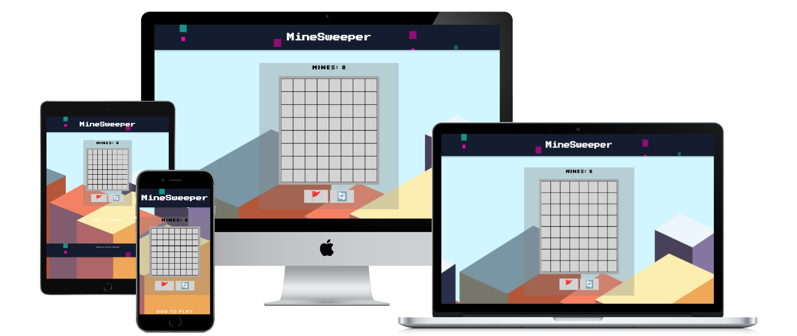
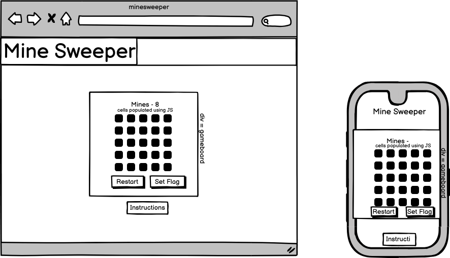
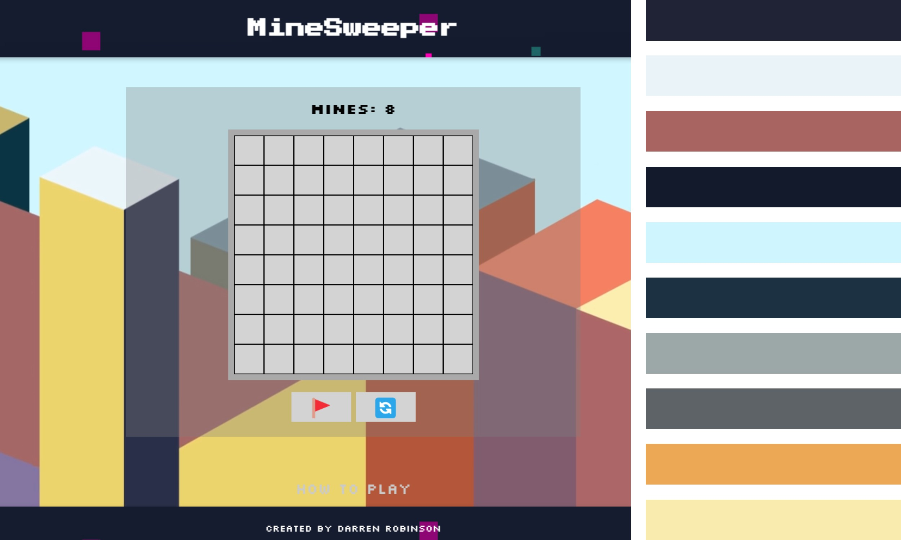

# MineSweeper
This game is a browser based version of the Minesweeper videogame originally created by Microsoft in the 1990's. The idea of the game is to clear all of the cells which don't contain a mine; if you click on a square with a mine it's game over! Once you have completed a level you can click new game to start a new one.

The live link can be found at - [MineSweeper](https://darrenrob25.github.io/MineSweeperProject/)

***

## Project Goals and User Experience

### Project Goals
* The goal of this project is to make a fun recreation of the minesweeper game within the browser.

* It has beeen designed to be easy to play and enjoyable.

### User Stories
#### First Time User
|Story No.|Story|
| ------------- | ------------- |
|1|As a first time user ,   I want to be able to know how to start the game   so that I can enjoy the game.    I know I am done, when there is a clear button to start the game.|
|2|As a first time user,   I want to be able to know how to play the game   so that I know I am playing the game correctly.   I know this has been achieved when the user can view the game instructions. |
|3|As a first time user,   I want to be able to know when I have hit a mine  so that I understand when the game is over   I know I am done there is a notification that the game is over. |

#### All Users
|Story No.|Story|
| ------------- | ------------- |
|1|As a user,   I want to be able to play the game   so that I can enjoy the game.    I know I am done, when the game is in a fully playable state. |
|2|As a user,   I want to be able to restart the game   so that I can play again if I lose/win.    I know this has been achieved there is the ability to restart the game. |

***

## Design
### Wireframes
Below are the designs that I will use as a reference point to help build the site. I have built these designs while keeping in mind the needs of my user stories.

#### Game Page Design

#### Color Scheme
The Colour palette was generated on [coolors](https://coolors.co/)

